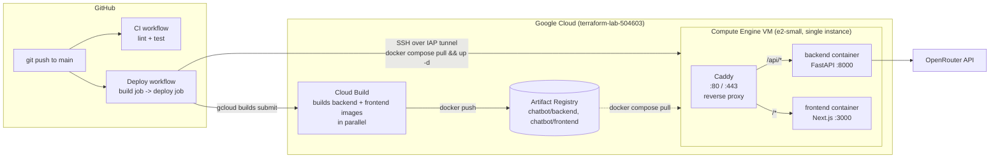
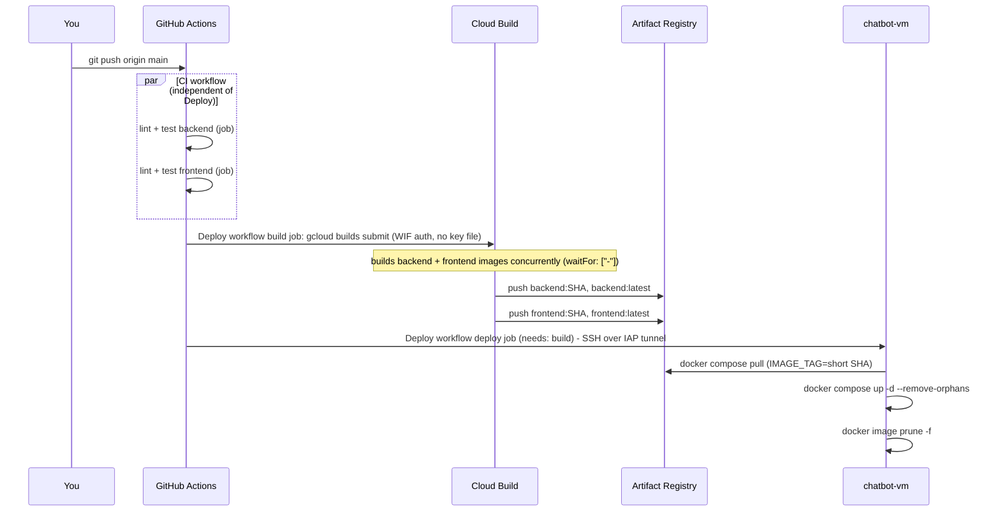

# OpenRouter Chatbot

A minimal chat app powered by [OpenRouter](https://openrouter.ai): a FastAPI backend that
streams completions from any OpenRouter model, and a Next.js frontend with a claude.ai-style
chat UI — deployed to a single low-cost GCP VM with CI/CD via GitHub Actions + Cloud Build.

This document covers the architecture, every component involved, exactly how a deployment
flows from `git push` to a running container, local development, first-time GCP setup, and
the real issues hit (and fixed) while standing this up — kept here so they don't have to be
re-discovered.

## Contents

- [Architecture](#architecture)
- [Components](#components)
- [Repository layout](#repository-layout)
- [How a deployment happens](#how-a-deployment-happens)
- [Local development](#local-development)
- [Deploying to GCP from scratch](#deploying-to-gcp-from-scratch)
- [Operating the live deployment](#operating-the-live-deployment)
- [Configuration reference](#configuration-reference)
- [Troubleshooting / lessons learned](#troubleshooting--lessons-learned)
- [Cost note](#cost-note)

## Architecture

One VM, three containers, no load balancer, no Kubernetes. Cloud Build only *compiles*
images — it never runs the app; the VM is the only thing serving traffic.



## Components

| Component | Role | Why this choice |
|---|---|---|
| **FastAPI** (`backend/`) | Streams OpenRouter chat completions to the frontend over Server-Sent Events | Async-native, small footprint, easy SSE streaming |
| **Next.js 16** (`frontend/`) | Chat UI (App Router, streaming message rendering, markdown) | Matches "structure Claude Code insists on"; standalone output keeps the Docker image small |
| **Caddy** | Reverse proxy on the VM: routes `/api/*` to the backend, everything else to the frontend | One binary, automatic HTTPS with zero extra config *if* a real domain is set — see [DOMAIN gotcha](#6-caddy-treated-an-empty-domain-as-a-real-hostname) |
| **Docker / Docker Compose** | Packages and runs all three services on the VM | Minimal orchestration for a single-VM deployment — no Kubernetes needed |
| **Cloud Build** | Builds the backend and frontend Docker images and pushes them to Artifact Registry | Managed build service; keeps image builds off the (deliberately small) VM entirely |
| **Artifact Registry** | Stores the built Docker images (`chatbot/backend`, `chatbot/frontend`) | GCP-native, private, integrates with Compute Engine service-account auth (no key files) |
| **Compute Engine VM** (`chatbot-vm`, `e2-small`) | Runs the actual app | Single instance instead of a managed cluster — matches the "minimal resources" requirement |
| **GitHub Actions** | Two workflows: `ci.yml` (lint/test on every push/PR) and `deploy.yml` (build + roll out on push to `main`) | Free for public/small-private repos, no separate CI system to run |
| **Workload Identity Federation** | Lets GitHub Actions authenticate to GCP with short-lived OIDC tokens | No downloaded service-account JSON key sitting in GitHub secrets |
| **IAP (Identity-Aware Proxy) TCP tunneling** | `gcloud compute ssh --tunnel-through-iap` reaches the VM without a public SSH port | Port 22 is closed to the internet entirely (see firewall rules); only IAM-authorized identities can tunnel in |
| **OS Login** (`compute.osAdminLogin`) | Maps the `github-deployer` service account to a real (passwordless-sudo) Linux user on the VM | Avoids granting the broad `compute.instances.setMetadata` permission that legacy SSH-key-based access would need |

## Repository layout

```
backend/            FastAPI app (streams OpenRouter chat completions over SSE)
  app/
    api/routes/      /health, /chat endpoints
    core/            settings (pydantic-settings) + optional shared-secret auth
    services/        OpenRouter HTTP client (SSE parsing)
    models/          request/response schemas
  tests/             pytest suite (health check, auth gate)
  Dockerfile

frontend/            Next.js 16 App Router UI
  app/               root layout + page
  components/        ChatWindow, ChatInput, MessageBubble
  lib/                SSE client (api.ts), shared types
  Dockerfile          multi-stage build -> Next.js "standalone" output

deploy/Caddyfile     Reverse proxy config — lives on the VM at /opt/chatbot/deploy/Caddyfile,
                     NOT synced automatically by the deploy pipeline (see below)
infra/
  setup.sh            One-time GCP setup (reference script — read & run by hand)
  vm-startup.sh       VM boot script: installs Docker, configures Artifact Registry auth

cloudbuild.yaml       Builds + pushes both images (parallel build steps)
docker-compose.yml    Production compose file — lives on the VM, pulls prebuilt images
docker-compose.dev.yml Local dev compose file — builds from source
.github/workflows/
  ci.yml              Lint + test, backend and frontend as parallel jobs
  deploy.yml          build job (Cloud Build) -> deploy job (SSH rollout)
```

**Important asymmetry to remember**: `deploy.yml`'s `deploy` job only ever runs
`docker compose pull && up -d` on the VM. It does **not** re-copy `docker-compose.yml` or
`deploy/Caddyfile` from the repo. Those two files were placed on the VM once, by hand,
during first-time setup — if you change either of them, you must manually `scp` the update
and recreate the affected container (see [Operating the live deployment](#operating-the-live-deployment)).
Only the backend/frontend *application* images are what the automated pipeline updates.

## How a deployment happens



Where the actual parallelism lives:

1. **`ci.yml`** runs its `backend` and `frontend` jobs concurrently — two separate GitHub
   Actions runners, neither waits on the other.
2. **`cloudbuild.yaml`** builds the backend and frontend Docker images concurrently within
   the same Cloud Build invocation (`waitFor: ["-"]` on both steps means neither waits for
   the other — only the final `docker push` of each image waits on its own build).
3. **`deploy.yml`**'s two jobs are the one place things are deliberately *sequential*:
   `deploy` has `needs: build`, so the VM is never told to pull images that Cloud Build
   hasn't finished pushing yet.

Tags: every build is pushed as both `<short-sha>` and `latest`; the VM always deploys the
specific short-SHA tag matching the commit that triggered the run (`IMAGE_TAG` env var in
`docker-compose.yml`), so what's running on the VM is traceable back to an exact commit.

## Local development

Requires Python 3.12+, Node 20+, and an [OpenRouter API key](https://openrouter.ai/keys).

```bash
cp .env.example .env          # fill in OPENROUTER_API_KEY at minimum
```

**Backend:**

```bash
cd backend
python -m venv .venv && source .venv/bin/activate   # Windows: .venv\Scripts\activate
pip install -r requirements-dev.txt
uvicorn app.main:app --reload
```

**Frontend** (separate terminal):

```bash
cd frontend
cp .env.local.example .env.local
npm install
npm run dev
```

Open http://localhost:3000.

**Or via Docker Compose** (both services, no hot reload):

```bash
docker compose -f docker-compose.dev.yml up --build
```

### Tests & linting

```bash
cd backend && pytest && ruff check .
cd frontend && npm run lint && npm run build
```

Both run automatically in `.github/workflows/ci.yml` on every push/PR to `main`.

## Deploying to GCP from scratch

### 1. One-time GCP setup

Edit the variables at the top of [infra/setup.sh](infra/setup.sh) (project ID, region,
GitHub org/repo, etc.), then run it section by section (it's a reference script, not
meant to be blindly executed):

```bash
bash infra/setup.sh
```

This creates:
- An Artifact Registry Docker repo
- A `github-deployer` service account + Workload Identity Federation, so GitHub Actions
  authenticates with short-lived tokens instead of a downloaded JSON key
- The VM (`e2-small` by default — 2 vCPU / 2GB RAM; see the [cost note](#cost-note)) with a
  dedicated runtime service account that can pull from Artifact Registry with no key file,
  and OS Login enabled so IAM (not instance metadata) controls SSH access
- Firewall rules: 80/443 open to the world, port 22 restricted to Google's IAP range only
  (no public SSH)

The script prints a `WORKLOAD_IDENTITY_PROVIDER` and `GCP_SERVICE_ACCOUNT` value at the
end — you need both for step 2.

> If the project already has a Workload Identity Federation pool from other CI/CD (common
> if it's shared with other infra work), the script reuses that pool and adds a **new
> provider** scoped only to this repo, rather than editing the existing provider's trust
> condition — so other pipelines using that pool are untouched.

### 2. GitHub repo configuration

Under **Settings → Secrets and variables → Actions → Variables**, add:

| Variable | Example |
|---|---|
| `GCP_PROJECT_ID` | `your-gcp-project-id` |
| `GCP_REGION` | `us-central1` |
| `GCP_ZONE` | `us-central1-a` |
| `ARTIFACT_REGISTRY_REPO` | `chatbot` |
| `VM_NAME` | `chatbot-vm` |
| `WORKLOAD_IDENTITY_PROVIDER` | printed by `infra/setup.sh` |
| `GCP_SERVICE_ACCOUNT` | printed by `infra/setup.sh` |

No `GCP_SA_KEY` secret needed — that's the point of Workload Identity Federation.

### 3. Bootstrap the VM once by hand

The very first deploy has to be manual because the VM needs `docker-compose.yml`,
`deploy/Caddyfile`, and a real `.env` (with your `OPENROUTER_API_KEY`) in `/opt/chatbot`
before `docker compose up` means anything. After this, GitHub Actions' `deploy` job
re-runs `docker compose pull && up -d` on every push to `main` — it doesn't touch these
files again (see the [asymmetry note](#repository-layout) above).

```bash
gcloud compute ssh chatbot-vm --zone us-central1-a --tunnel-through-iap

# on the VM:
sudo mkdir -p /opt/chatbot/deploy
exit

# from your machine:
gcloud compute scp docker-compose.yml chatbot-vm:/tmp/ --zone us-central1-a --tunnel-through-iap
gcloud compute scp deploy/Caddyfile chatbot-vm:/tmp/Caddyfile --zone us-central1-a --tunnel-through-iap
gcloud compute scp .env chatbot-vm:/tmp/ --zone us-central1-a --tunnel-through-iap

gcloud compute ssh chatbot-vm --zone us-central1-a --tunnel-through-iap
# on the VM:
sudo mv /tmp/docker-compose.yml /opt/chatbot/
sudo mv /tmp/Caddyfile /opt/chatbot/deploy/
sudo mv /tmp/.env /opt/chatbot/
cd /opt/chatbot
sudo docker compose pull
sudo docker compose up -d
```

Point a DNS `A` record at the VM's external IP and set `DOMAIN=your.domain.com` in the
VM's `.env` (then `sudo docker compose up -d --force-recreate caddy`) to get automatic
HTTPS from Caddy. Without a domain, `DOMAIN` resolves to plain `:80` and Caddy serves HTTP
only — see the [DOMAIN gotcha](#6-caddy-treated-an-empty-domain-as-a-real-hostname) for why
it must default this way rather than to `localhost`.

### 4. Ship changes

From then on, `git push` to `main` is the whole deploy — see
[How a deployment happens](#how-a-deployment-happens). Watch progress under the repo's
**Actions** tab.

## Operating the live deployment

Common operations, all via `gcloud compute ssh chatbot-vm --zone <zone> --tunnel-through-iap --command "..."`
(or drop `--command` for an interactive session):

| Task | Command (run on the VM, in `/opt/chatbot`) |
|---|---|
| Check container status | `sudo docker compose ps` |
| Tail logs | `sudo docker compose logs -f backend` (or `frontend`, `caddy`) |
| Manually redeploy latest images | `sudo docker compose pull && sudo docker compose up -d` |
| Apply a changed `Caddyfile` or `docker-compose.yml` | `scp` the file up, then `sudo docker compose up -d --force-recreate <service>` (env/config changes need `--force-recreate`, not just `restart`) |
| Free disk from old images | `sudo docker image prune -f` |

## Configuration reference

See [.env.example](.env.example) for every variable. The two you must set:

- `OPENROUTER_API_KEY` — from https://openrouter.ai/keys
- `OPENROUTER_MODEL` — any model slug from https://openrouter.ai/models (default:
  `anthropic/claude-haiku-4.5`). Model catalogs change — if `/chat` returns a 404 "No
  endpoints found" error, the configured slug has likely been retired; check the models
  endpoint for a current one.

`APP_SHARED_SECRET` is optional defense-in-depth: the backend port is never published to
the internet directly (only Caddy is, and it only proxies `/api/*` to it), so this mainly
guards against something else on the VM's Docker network reaching `/chat`. Because
`NEXT_PUBLIC_APP_SHARED_SECRET` ends up in the shipped JS bundle, it does **not** hide the
key from real visitors — don't rely on it as your only access control if that matters to you.

## Troubleshooting / lessons learned

Real issues hit standing this up for the first time, kept here so a future re-deploy (or a
similar project) doesn't have to rediscover them from scratch.

#### 1. `gcloud builds submit` image tag came out empty
Cloud Build's built-in `$SHORT_SHA` substitution is only populated for **repo-trigger**
builds. `deploy.yml` invokes Cloud Build via `gcloud builds submit` from an uploaded
tarball of the checked-out repo — no trigger, no git metadata — so `$SHORT_SHA` resolved to
an empty string, producing an invalid image reference like `...backend:`. Fixed by passing
the tag explicitly as a custom substitution (`_TAG=${GITHUB_SHA::7}`) instead of relying on
the builtin.

#### 2. Frontend Docker build failed: `COPY failed: stat app/public: file does not exist`
The frontend `Dockerfile` copies `/app/public` from the build stage, but the project never
had a `public/` directory (no static assets were needed). `next build` doesn't care
locally, but Docker's `COPY` fails outright on a nonexistent source path. Fixed by adding
`frontend/public/.gitkeep` so the directory exists and is tracked.

#### 3. `gcloud compute ssh` failed: missing `compute.instances.setMetadata`
Without OS Login enabled, `gcloud compute ssh` falls back to writing an SSH public key into
instance/project metadata, which needs a much broader permission than intended. Fixed by
enabling OS Login on the VM (`enable-oslogin=TRUE` metadata), so the already-granted
`compute.osLogin`-family role is used instead.

#### 4. SSH connected, but `sudo` failed: "a terminal is required to read the password"
Plain `compute.osLogin` grants a POSIX account on the VM but *not* passwordless sudo — and
the deploy step's `gcloud compute ssh --command "sudo docker compose ..."` has no TTY to
prompt for one. Fixed by granting `compute.osAdminLogin` instead, which maps to a
sudo-capable account.

#### 5. Cloud Build: "forbidden from accessing the bucket \[PROJECT\_cloudbuild\]"
`gcloud builds submit` uploads the source tarball to a GCS staging bucket Cloud Build
manages automatically. This project's org policy blocked that bucket for the
`github-deployer` service account despite it already holding `cloudbuild.builds.editor`.
Fixed by granting `roles/storage.admin` — broader than it looks, but it's the same
workaround already in use by this project's other CI/CD service accounts.

#### 6. Caddy treated an empty `DOMAIN` as a real hostname
This one took two attempts to actually fix:

- **First**: `deploy/Caddyfile` used `{$DOMAIN:localhost}`, so with no `DOMAIN` set, Caddy
  tried to auto-provision HTTPS for the literal hostname `"localhost"`. A browser or `curl`
  connecting via the VM's bare IP presents a different SNI, matches nothing, and the TLS
  handshake fails outright (`ERR_SSL_PROTOCOL_ERROR` in Chrome, `SEC_E_ILLEGAL_MESSAGE` in
  curl/schannel on Windows) — not just an untrusted-cert warning, a hard failure.
- **Second**: switching the Caddyfile default to `{$DOMAIN::80}` (plain HTTP if unset)
  still didn't work, because **Docker Compose always injects `DOMAIN` into the container**
  — as an empty string if unset — and Caddy's `{$VAR:default}` only falls back when a
  variable is *completely absent* from the process environment, not when it's set-but-empty.
  Caddy kept getting an empty site address and crash-looped.

  Fixed by resolving the default in `docker-compose.yml` instead, where Compose's own
  `${VAR:-default}` syntax correctly treats "unset" and "empty" the same way:
  `DOMAIN=${DOMAIN:-:80}`. The Caddyfile now just uses `{$DOMAIN}` directly, since Compose
  guarantees it's always a valid, non-empty value by the time Caddy sees it.

## Cost note

`e2-small` (2 vCPU burstable, 2GB RAM) runs a few dollars a month at sustained-use pricing
and comfortably fits Caddy + Next.js (standalone) + FastAPI. `e2-micro` (1GB RAM, free-tier
eligible in `us-west1`/`us-central1`/`us-east1`) can work too but is tight — add a swap
file if you go that route.
